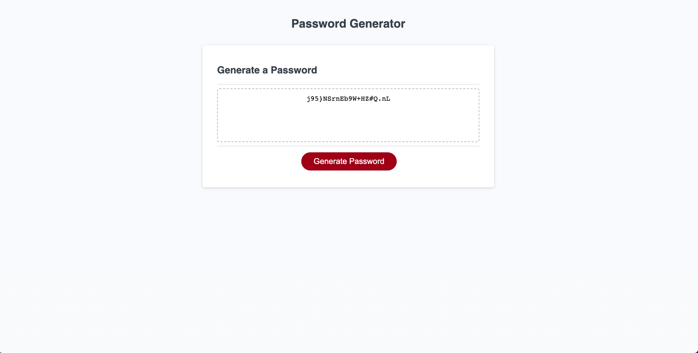

# Password-Generator

## Description

This project prompts the user to select various attributes to generate a password, such as length and type of characters included (lowercase, uppercase, etc.). The randomly generated password is then displayed on the webpage in a read-only text box.

## Usage

Click the following link to visit the website: https://amman98.github.io/Password-Generator/. Then, click the button 'Generate Password' and you will be provided with detailed prompts asking the user for inputs.

## License

Please refer to the LICENSE in the repo.